# Kirin Gateway 架构文档

## 目录

- [整体架构](#整体架构)
- [启动流程](#启动流程)
- [控制面 / 数据面分离](#控制面--数据面分离)
- [请求处理流程](#请求处理流程)
- [路由匹配](#路由匹配)
- [Filter Chain](#filter-chain)
- [负载均衡](#负载均衡)
- [令牌桶限流](#令牌桶限流)
- [配置热重载](#配置热重载)
- [Admin API](#admin-api)
- [可观测性](#可观测性)
- [项目结构](#项目结构)

---

## 整体架构

Kirin Gateway 采用 **控制面 / 数据面分离** 架构，共享状态通过 `Arc<RwLock<GatewayState>>` 桥接两个面：

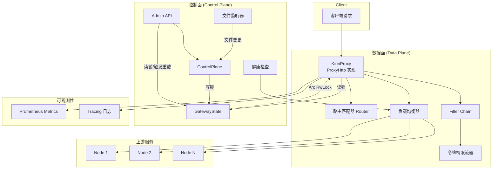

---

## 启动流程

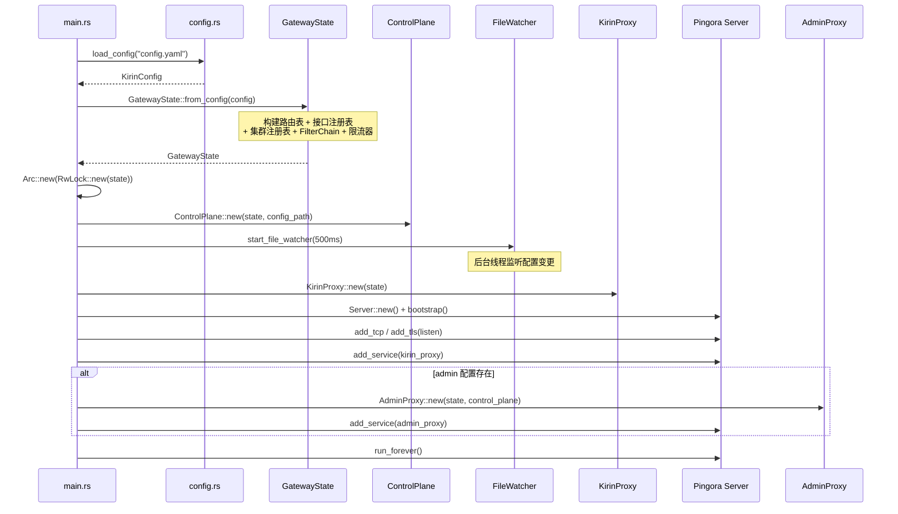

---

## 控制面 / 数据面分离

两个面通过 `Arc<RwLock<GatewayState>>` 共享运行时状态，遵循 **控制面写、数据面读** 的原则：

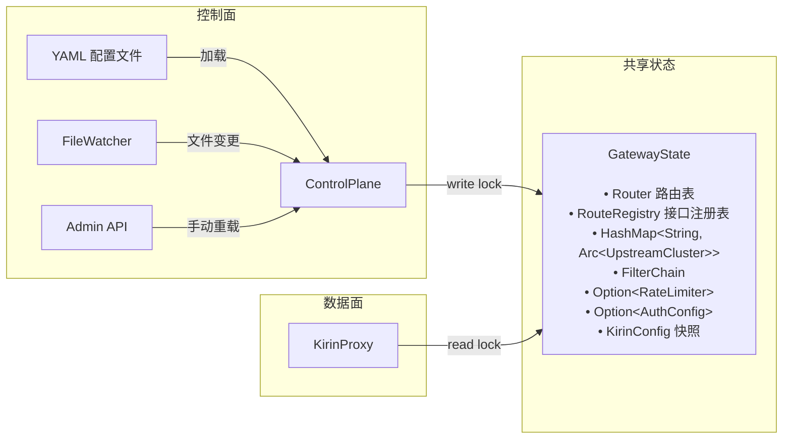

| 面 | 职责 | 锁类型 |
|---|---|---|
| **控制面** | 配置加载、校验、热重载、Admin API | 写锁 (write) |
| **数据面** | 路由匹配、Filter Chain、代理转发、负载均衡 | 读锁 (read) |

---

## 请求处理流程

一个完整的请求经过 Pingora `ProxyHttp` trait 的多个生命周期钩子：

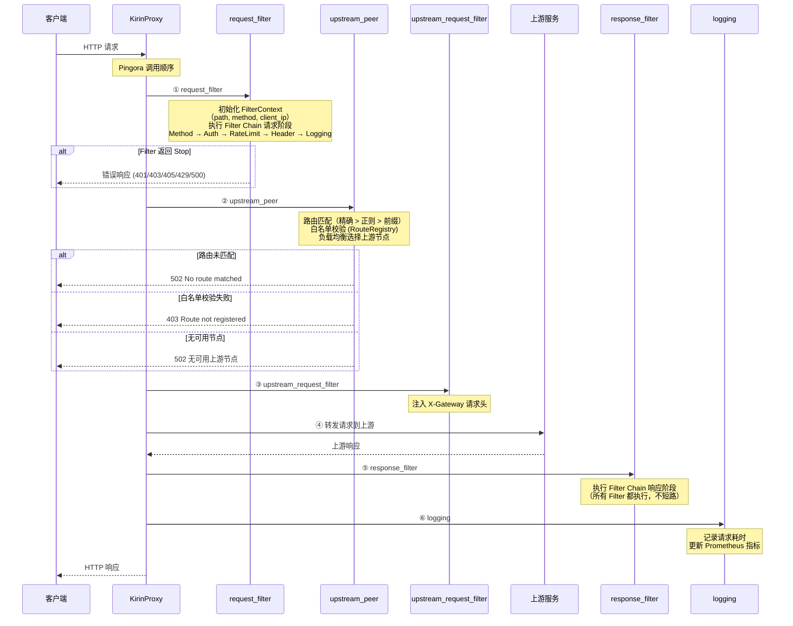

### 各阶段详情

| 阶段 | Pingora 钩子 | 主要职责 |
|------|-------------|---------|
| ① | `request_filter` | 初始化 `FilterContext`；执行 Filter Chain 请求阶段（Method → Auth → RateLimit → Header → Logging）；处理 `/metrics` 端点 |
| ② | `upstream_peer` | 路由匹配 + 白名单校验 + 负载均衡选节点；返回 `HttpPeer` |
| ③ | `upstream_request_filter` | 注入 `X-Gateway: Kirin Gateway` 请求头给上游 |
| ④ | Pingora 内部 | 将请求转发到选定的上游节点 |
| ⑤ | `response_filter` | 执行 Filter Chain 响应阶段（注入响应头、日志等） |
| ⑥ | `logging` | 记录请求耗时、更新 Prometheus 计数器/直方图 |

---

## 路由匹配

`Router` 维护三张路由表，按优先级依次匹配：

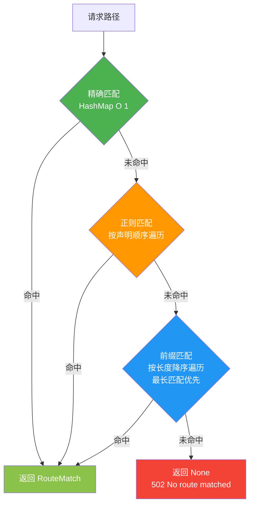

| 匹配类型 | 数据结构 | 复杂度 | 说明 |
|---------|---------|--------|------|
| 精确匹配 (Exact) | `HashMap<String, RouteRule>` | O(1) | 路径完全一致 |
| 正则匹配 (Regex) | `Vec<(Regex, RouteRule)>` | O(n) | 按声明顺序，先声明优先 |
| 前缀匹配 (Prefix) | `Vec<(String, RouteRule)>` | O(n) | 按前缀长度降序，最长优先 |

白名单校验在 `upstream_peer` 阶段由 `RouteRegistry.resolve_path()` 执行，与路由匹配使用相同的优先级策略。

---

## Filter Chain

Filter Chain 采用 **正序执行** 模式（非洋葱模型）：

- **请求阶段**：任一 Filter 返回 `Stop` 即中断链路，后续 Filter 不执行
- **响应阶段**：所有 Filter 都执行，不短路

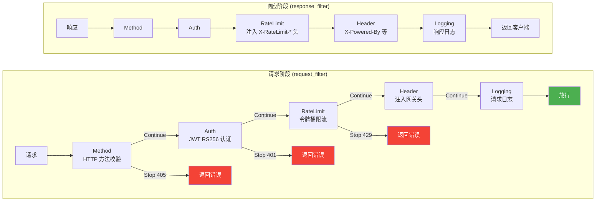

### Filter 接口

```rust
#[async_trait]
pub trait Filter: Send + Sync {
    fn name(&self) -> FilterName;

    async fn request_filter(
        &self,
        ctx: &mut FilterContext,
        request_header: &mut RequestHeader,
        state: &Arc<RwLock<GatewayState>>,
    ) -> FilterResult;  // Continue | Stop(FilterReject)

    async fn response_filter(
        &self,
        ctx: &mut FilterContext,
        response_header: &mut ResponseHeader,
    );
}
```

### FilterContext 字段

| 字段 | 类型 | 来源 |
|------|------|------|
| `path` | `String` | `request_filter` 阶段从 session 提取 |
| `method` | `String` | `request_filter` 阶段从 session 提取 |
| `client_ip` | `String` | `request_filter` 阶段从 session 提取 |
| `upstream_name` | `Option<String>` | `upstream_peer` 阶段设置 |
| `route_id` | `Option<String>` | `upstream_peer` 阶段设置（白名单校验后） |
| `start_time` | `Instant` | `request_filter` 阶段初始化 |
| `rate_limit_remaining` | `Option<usize>` | RateLimit Filter 设置 |
| `auth_user_id` | `Option<String>` | Auth Filter 设置 |

---

## 负载均衡

`UpstreamCluster` 封装了 Pingora `LoadBalancer`，通过 `LoadBalancerKind` 枚举支持多种算法：

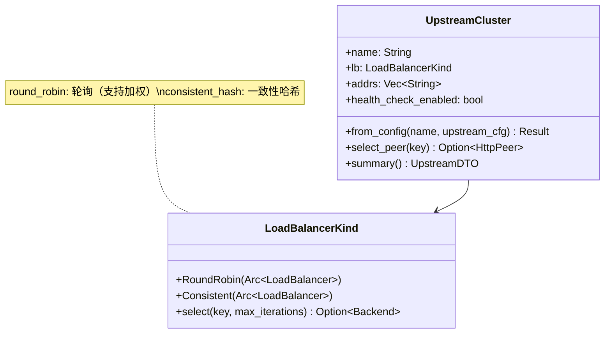

| 算法 | 配置值 | 特点 |
|------|-------|------|
| 加权轮询 | `round_robin` | 按 weight 比例分配，支持加权 |
| 一致性哈希 | `consistent_hash` | 相同 key 总是路由到相同节点 |

节点选择时，`select_peer(key)` 使用客户端 IP 的字节作为 key。

---

## 令牌桶限流

基于 IP 维度的进程内令牌桶限流：

```mermaid
flowchart TD
    REQ[请求到达] --> RL{RateLimiter}

    RL -->|获取 IP| BUCKET{查找 IP 对应的 TokenBucket}

    BUCKET -->|不存在| CREATE[创建新桶<br/>初始令牌 = capacity]
    CREATE --> REFILL
    BUCKET -->|已存在| REFILL[补充令牌<br/>tokens += elapsed * refill_rate<br/>不超过 capacity]

    REFILL --> CHECK{current_tokens > 0?}
    CHECK -->|是| ACQUIRE[消耗 1 个令牌<br/>返回 (true, remaining)]
    CHECK -->|否| REJECT[返回 (false, 0)<br/>HTTP 429]

    ACQUIRE --> PASS[放行请求]
    REJECT --> STOP[Filter Chain 中断]

    style PASS fill:#4CAF50,color:#fff
    style STOP fill:#F44336,color:#fff
```

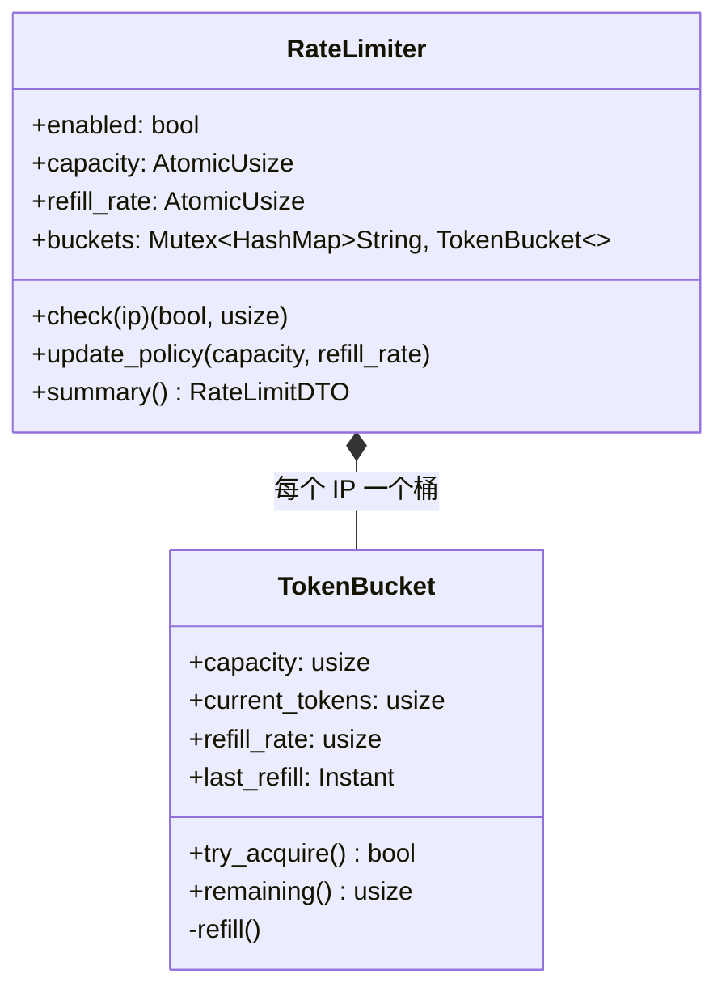

关键设计：
- `capacity` 和 `refill_rate` 使用 `AtomicUsize`，支持运行时动态更新
- 热重载时保留现有令牌桶实例和状态，仅更新策略参数

---

## 配置热重载

支持两种热重载策略：

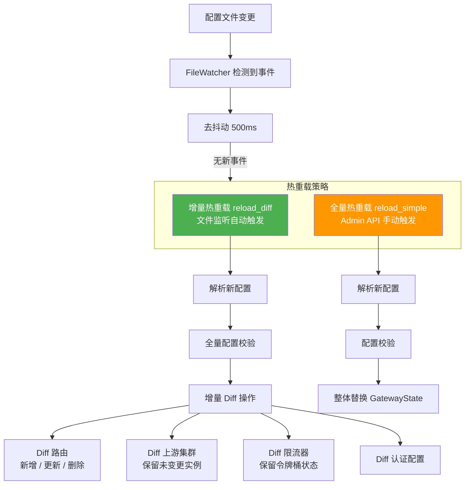

### 增量 Diff 策略

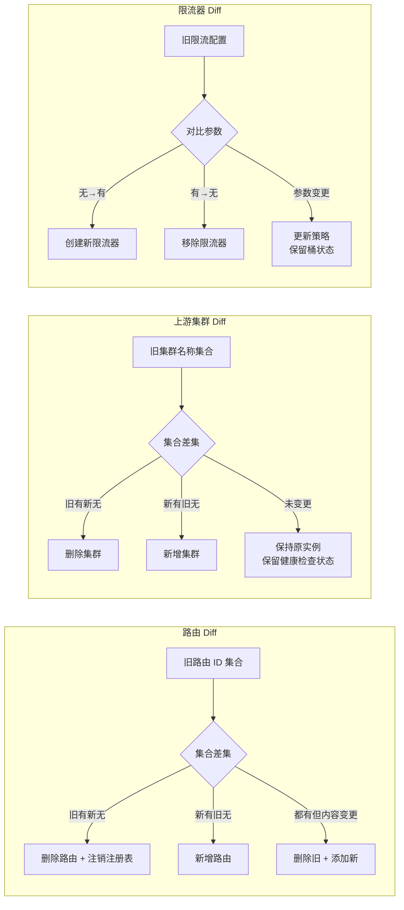

---

## Admin API

Admin API 是独立的 Pingora HTTP 服务，运行在独立端口，直接使用 `request_filter` 返回响应（不代理到上游）：

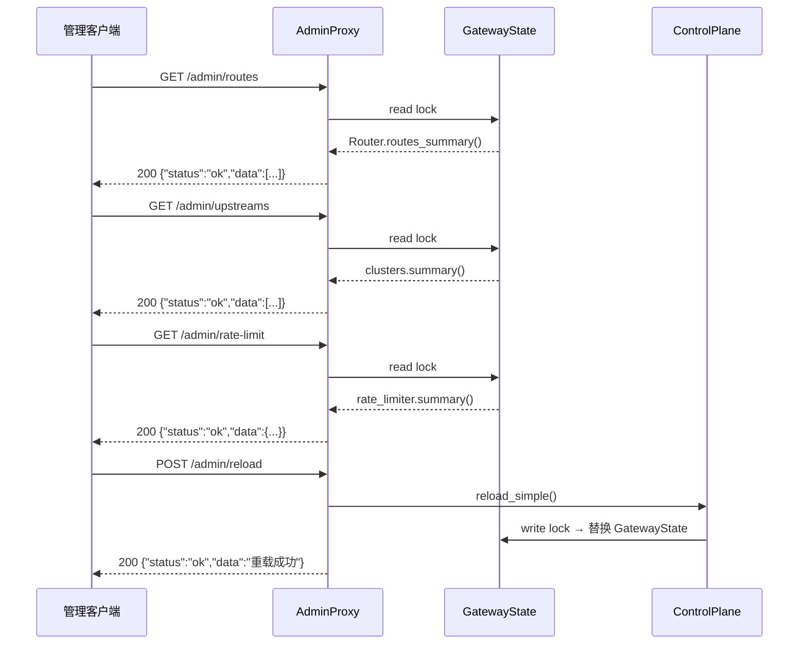

| 方法 | 路径 | 锁类型 | 说明 |
|------|------|--------|------|
| GET | `/admin/routes` | 读锁 | 查询所有路由规则 |
| GET | `/admin/upstreams` | 读锁 | 查询所有上游集群 |
| GET | `/admin/rate-limit` | 读锁 | 查询限流配置 |
| POST | `/admin/reload` | 写锁 | 全量热重载 |

---

## 可观测性

```mermaid
flowchart TB
    subgraph Metrics["Prometheus 指标 (GET /metrics)"]
        RT[kirin_requests_total<br/>Counter {method, upstream, status_code}]
        RD[kirin_request_duration_seconds<br/>Histogram {method, upstream}]
        UE[kirin_upstream_errors_total<br/>Counter {method, upstream}]
        FR[kirin_filter_rejects_total<br/>Counter {filter_name, status_code}]
    end

    subgraph Logging["Tracing 日志 (JSON)"]
        REQ_LOG[请求日志<br/>method, path, upstream, elapsed_ms, client_ip]
        RELOAD_LOG[热重载日志<br/>路由/集群/限流器变更记录]
        FILTER_LOG[Filter 日志<br/>拒绝原因, Filter 名称]
    end

    RT --> PROM[Prometheus 采集]
    RD --> PROM
    UE --> PROM
    FR --> PROM

    REQ_LOG --> STDOUT[stdout JSON 输出]
    RELOAD_LOG --> STDOUT
    FILTER_LOG --> STDOUT
```

| 指标 | 类型 | 标签 | 说明 |
|------|------|------|------|
| `kirin_requests_total` | Counter | method, upstream, status_code | 请求总数 |
| `kirin_request_duration_seconds` | Histogram | method, upstream | 请求延迟分布 |
| `kirin_upstream_errors_total` | Counter | method, upstream | 上游错误总数 |
| `kirin_filter_rejects_total` | Counter | filter_name, status_code | Filter 拒绝总数 |

---

## 项目结构

```
src/
├── main.rs                              # 入口：加载配置、启动 Pingora Server
├── config/
│   ├── loader.rs                        # 配置文件加载（read + parse）
│   ├── types.rs                         # KirinConfig 等配置类型定义
│   └── validation.rs                    # 配置校验逻辑
├── control_plane/
│   ├── control_plane.rs                 # 控制面：配置加载、热重载、文件监听
│   ├── gateway_state.rs                 # 共享状态 GatewayState + 增量 Diff
│   ├── admin_api.rs                     # Admin API 代理服务
│   │   └── dto.rs                       # Admin API 数据传输对象
│   └── health_check.rs                  # TCP 健康检查
├── data_plane/
│   ├── proxy.rs                         # KirinProxy（ProxyHttp trait 实现）
│   ├── router.rs                        # 路由匹配器（精确/前缀/正则）
│   │   └── router_white_list.rs         # 接口注册表（白名单校验）
│   ├── upstream.rs                      # 上游集群（负载均衡封装）
│   ├── rate_limit.rs                    # 令牌桶限流器
│   ├── filter.rs                        # Filter trait + FilterChain 编排
│   └── filter/
│       ├── auth.rs                      # JWT RS256 认证 Filter
│       ├── header.rs                    # Header 注入 Filter
│       ├── logging.rs                   # 日志 Filter
│       ├── method.rs                    # HTTP 方法校验 Filter
│       ├── rate_limit_filter.rs         # 限流 Filter
│       └── whitelist.rs                 # 白名单 Filter
└── observability/
    └── metrics.rs                       # Prometheus 指标定义与收集
```
