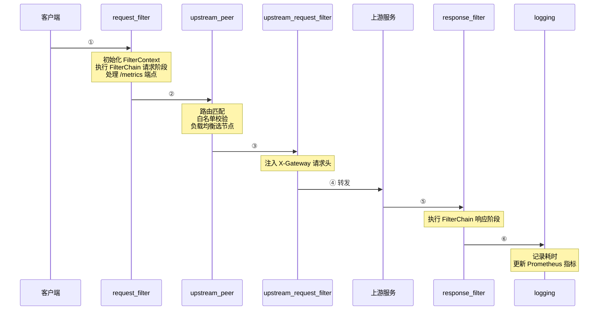

# 代理层（Proxy Layer）

## 核心设计

### 运行时动态状态

将所有运行时状态提炼到共享状态层 `GatewayState` 中，通过 `Arc<RwLock<GatewayState>>` 实现控制面/数据面共享：

```rust
pub struct KirinProxy {
    pub state: Arc<RwLock<GatewayState>>,
}
```

`KirinProxy` 不直接持有路由表、集群或 FilterChain，而是通过读锁从共享状态中获取。控制面通过写锁更新状态后，数据面下次读锁即可获取最新配置。

### RequestContext — 请求级状态

```rust
pub struct RequestContext {
    pub filter_ctx: Option<FilterContext>,
}
```

每次请求创建一个 `RequestContext`，在 `request_filter` 阶段初始化 `FilterContext`。与 `GatewayState` 不同，`RequestContext` 是请求级别的，不被共享。

---

## Pingora ProxyHttp 生命周期

`KirinProxy` 实现 Pingora `ProxyHttp` trait，请求经过以下 6 个生命周期钩子：



### 各钩子详情

| 钩子 | 返回值 | 主要职责 |
|------|--------|---------|
| `request_filter` | `Result<bool>` | `Ok(true)` = 已响应（短路），`Ok(false)` = 继续。初始化 FilterContext；执行 FilterChain 请求阶段；处理 `/metrics` |
| `upstream_peer` | `Result<Box<HttpPeer>>` | 路由匹配 + 白名单校验 + 选节点。失败时返回 Pingora Error |
| `upstream_request_filter` | `Result<()>` | 注入 `X-Gateway: Kirin Gateway` 请求头给上游 |
| `response_filter` | `Result<()>` | 执行 FilterChain 响应阶段 |
| `logging` | — | 记录请求耗时、更新 Prometheus 计数器/直方图 |
| `fail_to_connect` | `Box<Error>` | 连接失败时标记 `set_retry(true)`，Pingora 自动重试 |

### /metrics 短路处理

`request_filter` 中对 `/metrics` 路径特殊处理，直接返回 Prometheus 指标文本，不经过上游：

```rust
if path == "/metrics" {
    let body = crate::observability::metrics::collect();
    // 直接写入响应并返回 Ok(true)
    return Ok(true);
}
```

### 锁使用注意事项

- FilterChain 通过 `state.read()` 获取后 **clone** 再释放锁，避免 `RwLockReadGuard` 跨 `.await`
- `upstream_peer` 中直接持有读锁直到方法返回（同步操作，无 `.await`）
- 锁 poisoned 时通过 `unwrap_or_else(|e| e.into_inner())` 自动恢复
