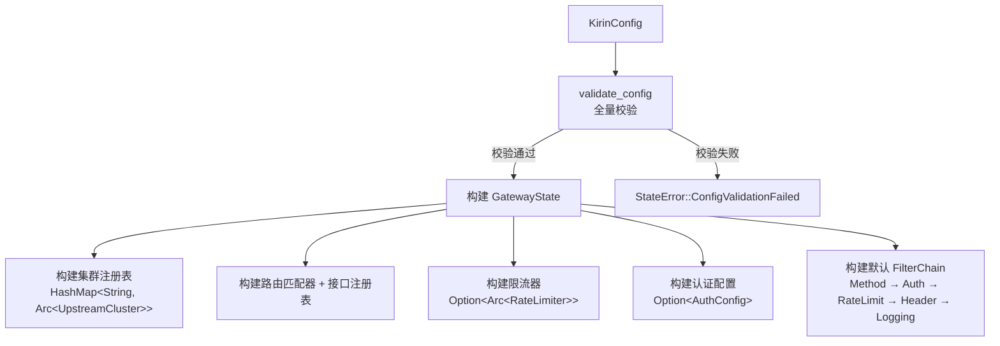
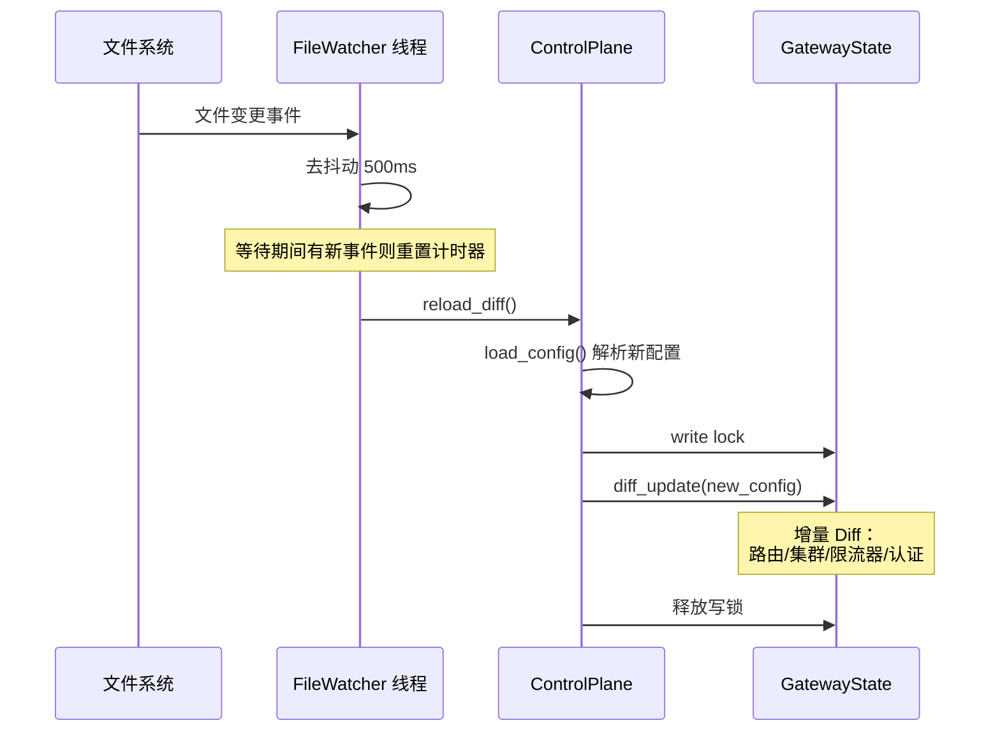

# 控制面（Control Plane）

## 职责

控制面负责**配置管理和状态构建**，不直接处理业务请求。它通过写锁更新 `GatewayState`，数据面通过读锁读取最新状态。

## 核心组件

| 组件 | 文件 | 职责 |
|------|------|------|
| `ControlPlane` | `src/control_plane/control_plane.rs` | 配置加载、热重载、文件监听 |
| `GatewayState` | `src/control_plane/gateway_state.rs` | 网关运行时共享状态 + 增量 Diff |
| `AdminProxy` | `src/control_plane/admin_api.rs` | Admin API 代理服务 |
| 健康检查 | `src/control_plane/health_check.rs` | TCP 健康检查配置 |

## GatewayState — 共享状态

```rust
pub struct GatewayState {
    pub router: Router,                                 // 路由匹配器
    pub registry: RouteRegistry,                        // 接口注册表（白名单）
    pub clusters: HashMap<String, Arc<UpstreamCluster>>, // 上游集群注册表
    pub filter_chain: FilterChain,                      // 过滤器链
    pub rate_limiter: Option<Arc<RateLimiter>>,          // 令牌桶限流器
    pub auth_config: Option<AuthConfig>,                 // JWT 认证配置
    config_snapshot: KirinConfig,                        // 配置快照（用于增量 Diff）
}
```

### 构建流程



### 校验项

`from_config` 在构建前执行全量校验（`validate_config`），任何一项失败都会阻止网关启动：

| 类别 | 校验规则 |
|------|---------|
| 路由 | `route_id` 非空且唯一、`match_type` 合法、`upstream` 引用存在 |
| 上游 | 节点地址格式合法、`weight > 0` |
| 限流 | `capacity > 0`、`refill_rate > 0` |
| 认证 | `algorithm` 为 RS256、公钥文件可加载 |

## 热重载

### 文件监听

`ControlPlane::start_file_watcher` 启动后台线程监听配置文件变更：



### 三种重载策略

| 方法 | 触发方式 | 行为 |
|------|---------|------|
| `reload_diff()` | 文件监听自动触发 | 增量 Diff，只更新变更部分 |
| `reload_simple()` | Admin API `POST /admin/reload` | 全量替换 `GatewayState` |
| `load_and_apply()` | 程序调用 | 全量替换（含限流桶状态处理） |

### 增量 Diff 策略

`diff_update()` 对比新旧配置快照，按模块执行增量更新：

| 模块 | Diff 策略 | 保留状态 |
|------|---------|---------|
| 路由 | 以 `route_id` 为 key，新增/变更/删除 | — |
| 上游集群 | 以服务名称为 key，新增/变更/删除 | 未变更集群保持 `Arc` 指针，保留健康检查状态 |
| 限流器 | 对比 capacity/refill_rate | 保留令牌桶实例，仅更新策略参数 |
| 认证 | 对比 algorithm/public_key_path/issuer | — |

## Admin API

独立的 Pingora HTTP 服务，运行在独立端口。详见 [README.md](../../README.md) 中的 Admin API 章节。

| 方法 | 路径 | 锁类型 | 说明 |
|------|------|--------|------|
| GET | `/admin/routes` | 读锁 | 查询所有路由规则 |
| GET | `/admin/upstreams` | 读锁 | 查询所有上游集群 |
| GET | `/admin/rate-limit` | 读锁 | 查询限流配置 |
| POST | `/admin/reload` | 写锁 | 全量热重载 |
