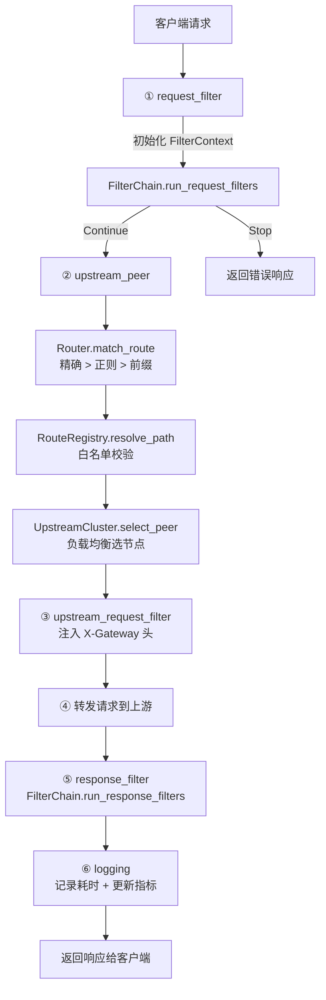

# 数据面（Data Plane）

## 职责

数据面只负责**请求处理**，不涉及配置管理。它通过读锁访问 `GatewayState` 获取路由表、集群注册表、FilterChain 等运行时状态。

## 核心组件

| 组件 | 文件 | 职责 |
|------|------|------|
| `KirinProxy` | `src/data_plane/proxy.rs` | 实现 Pingora `ProxyHttp` trait，编排请求生命周期 |
| `Router` | `src/data_plane/router.rs` | 路由匹配（精确 > 正则 > 前缀） |
| `RouteRegistry` | `src/data_plane/router/router_white_list.rs` | 接口白名单校验 |
| `UpstreamCluster` | `src/data_plane/upstream.rs` | 上游集群封装（负载均衡 + 节点选择） |
| `FilterChain` | `src/data_plane/filter.rs` | Filter 编排器（请求阶段可短路，响应阶段全执行） |
| `RateLimiter` | `src/data_plane/rate_limit.rs` | 基于 IP 的令牌桶限流器 |
| 内置 Filter | `src/data_plane/filter/` | Method / Auth / RateLimit / Header / Logging |

## 核心设计

### 无状态代理

`KirinProxy` 不直接持有任何可变状态，所有运行时数据通过共享状态层读取：

```rust
pub struct KirinProxy {
    pub state: Arc<RwLock<GatewayState>>,
}
```

### 请求处理链路



### 锁使用策略

数据面全程使用**读锁**访问共享状态：

| 阶段 | 锁操作 | 释放时机 |
|------|--------|---------|
| `request_filter` | 读锁获取 FilterChain → clone 后释放 | 立即 |
| `upstream_peer` | 读锁获取 Router + Registry + Cluster | 方法结束 |
| `response_filter` | 读锁获取 FilterChain → clone 后释放 | 立即 |
| `logging` | 无锁（仅读 RequestContext） | — |

关键原则：**RwLockReadGuard 不跨 `.await`**，避免持有锁期间执行异步操作导致其他线程阻塞。

### RequestContext — 请求级上下文

```rust
pub struct RequestContext {
    pub filter_ctx: Option<FilterContext>,
}
```

每次请求创建一个 `RequestContext`，在 `request_filter` 阶段初始化 `FilterContext`，在整个请求生命周期内传递。
