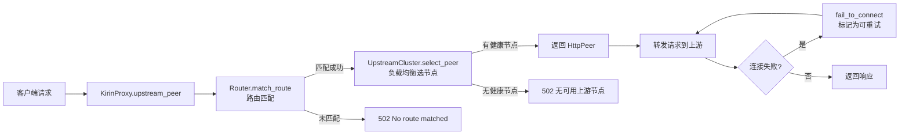

# 负载均衡模块

## 背景：为什么需要负载均衡

后端服务通常以多实例方式部署，负载均衡将请求分配给多个上游节点，避免单点过载，提高可用性。

## 项目实现概览

基于 Pingora `pingora-load-balancing`（v0.8.0），通过 `UpstreamCluster` 封装负载均衡逻辑，支持两种算法。

### 模块职责划分

| 模块 | 文件 | 职责 |
|------|------|------|
| 上游集群 | `src/data_plane/upstream.rs` | 定义 `UpstreamCluster`，封装节点选择逻辑 |
| 路由匹配 | `src/data_plane/router.rs` | 根据请求路径匹配对应的上游集群 |
| 代理服务 | `src/data_plane/proxy.rs` | 串联路由与负载均衡，处理请求转发与失败重试 |
| 健康检查 | `src/control_plane/health_check.rs` | TCP 健康检查，自动剔除故障节点 |

---

## 核心数据结构

### UpstreamCluster（上游集群）

定义在 `src/data_plane/upstream.rs`。

```rust
pub struct UpstreamCluster {
    pub name: String,                           // 集群名称
    pub lb: LoadBalancerKind,                   // 负载均衡器
    addrs: Vec<String>,                         // 节点地址列表（供 Admin API 查询）
    health_check_enabled: bool,                 // 是否配置了健康检查
}
```

### LoadBalancerKind（负载均衡策略枚举）

```rust
pub enum LoadBalancerKind {
    RoundRobin(Arc<LoadBalancer<selection::RoundRobin>>),
    Consistent(Arc<LoadBalancer<selection::Consistent>>),
}
```

通过枚举统一接口，`select(key, max_iterations)` 选择健康的后端节点。

---

## 支持的负载均衡算法

### 1. 加权轮询（Weighted Round Robin）

配置值：`round_robin`（默认）

按节点 `weight` 比例分配请求。例如两个节点权重 3:1，请求分配约为 3:1。

**适用场景**：
- 上游节点性能相近
- 请求处理开销差异不大
- 对均衡精度要求不高，追求简单可靠

**优缺点**：

| 优点 | 缺点 |
|------|------|
| 实现简单，开销极低 | 不考虑节点的实际负载差异 |
| 支持加权分配 | 无法感知连接数或响应时间 |
| 无状态，天然支持水平扩展 | — |

### 2. 一致性哈希（Consistent Hash）

配置值：`consistent_hash`

相同 key（当前为客户端 IP）总是路由到相同节点。当节点增减时，只有部分 key 的映射会变化。

**适用场景**：
- 需要会话保持（同一用户请求打到同一节点）
- 有本地缓存的上游服务（缓存命中率更高）

### 算法对比

| 特性 | Round Robin | Consistent Hash |
|------|-------------|-----------------|
| key 依赖 | 否（空 key） | 是（客户端 IP） |
| 节点变更影响 | 全部重新分配 | 仅部分 key 重新映射 |
| 均匀性 | 按权重均匀 | 取决于 key 分布 |
| 配置值 | `round_robin` | `consistent_hash` |

---

## 核心方法

### UpstreamCluster::from_config — 从配置创建集群

```rust
pub fn from_config(name: &str, upstream_cfg: &UpstreamConfig) -> Result<Self, String>
```

执行流程：
1. 解析节点地址（纯 IP:port 直接使用，hostname:port 做 DNS 解析）
2. 根据 `algorithm` 字段选择负载均衡策略
3. 配置健康检查（如果 `health_check` 字段存在）

### UpstreamCluster::select_peer — 选择上游节点

```rust
pub fn select_peer(&self, key: &[u8]) -> Option<Box<HttpPeer>>
```

使用客户端 IP 的字节作为 key，调用 `LoadBalancerKind::select()` 选出健康的后端节点。

### UpstreamCluster::summary — 集群摘要

```rust
pub fn summary(&self) -> UpstreamDTO
```

返回集群名称和节点地址列表，供 Admin API 查询。

---

## 请求处理流程



失败重试：`fail_to_connect` 中将错误标记为可重试（`set_retry(true)`），Pingora 会自动选择下一个节点重新尝试。

---

## 配置方式

```yaml
upstreams:
  # 加权轮询
  user-service:
    algorithm: round_robin
    nodes:
      - addr: "127.0.0.1:8081"
        weight: 2
      - addr: "127.0.0.1:8082"
        weight: 1
    health_check:
      interval_secs: 5
      timeout_secs: 3

  # 一致性哈希
  cache-service:
    algorithm: consistent_hash
    nodes:
      - addr: "127.0.0.1:9091"
        weight: 1
      - addr: "127.0.0.1:9092"
        weight: 1
```

| 字段 | 类型 | 必填 | 默认值 | 说明 |
|------|------|------|--------|------|
| `algorithm` | string | 否 | `round_robin` | 负载均衡算法，可选 `round_robin` / `consistent_hash` |
| `nodes` | NodeConfig[] | 是 | — | 后端节点列表 |
| `health_check` | HealthCheckConfig | 否 | — | 健康检查配置 |

---

## 集群注册与生命周期

集群以 `Arc<UpstreamCluster>` 形式存储在 `GatewayState.clusters`（`HashMap<String, Arc<UpstreamCluster>>`）中。

### 热重载行为

| 场景 | 行为 |
|------|------|
| 新增集群 | 调用 `from_config` 创建新实例 |
| 删除集群 | 从 HashMap 移除 |
| 配置变更 | 重建集群实例 |
| **未变更** | **保持原 `Arc` 指针不变**，保留健康检查状态和连接池 |

---

## 演进方向

| 方向 | 说明 |
|------|------|
| 最少连接数（Least Connections） | 基于实时连接数选择最优节点 |
| 加权一致性哈希 | 支持节点权重的一致性哈希 |
| 动态节点管理 | 通过 Admin API 运行时增删节点 |
| 连接池指标暴露 | 每个节点的活跃连接数、错误率 |
